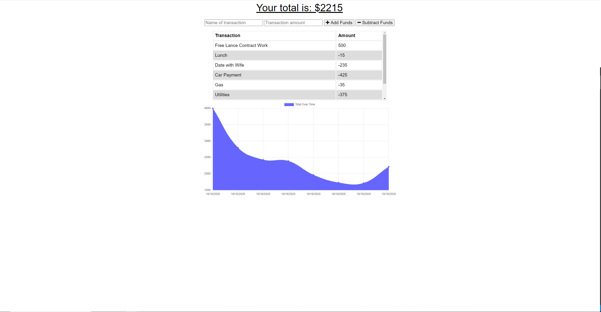

# PWA_Budget_Tracker

## Description  

[App Link](https://lit-lake-70806.herokuapp.com/)

A Progressive Web Application allowing a user to keep track of there daily budget while both on and offline.  Application uses IndexedDB in order to store offline transactions, and on connection will transfer the stored transactions to the MongoDB database.  Application uses MongoDB, Express.JS, and service workers to accomplish the task. 

* 

 
 
 

## Table of Contents  

* [Installation](installation-instructions)    
* [Usage](#usage-instructions)  
* [License](#license)  
* [Questions](#questions)

 
 
 

## Installation Instructions  

* Follow [Link](https://lit-lake-70806.herokuapp.com/) to online application.

* Locate the install option on your browser.  For Google Chrome this will be the plus located in the address line.

* 

* 

* Your browser will then install the application as a stand alone app that can be opened straight from the desktop or your mobile device without opening your browser.

* 

 
 
 

## Usage Instructions

* Application is hosted live on heroku.  Use this [Link](https://lit-lake-70806.herokuapp.com/) to try it out!
* Simply type in the name and dollar value for your expense or deposit and select the correct button. 
* Note that if you loose your internet connection or if you have the app downloaded on your phone and do not have a signal, all entries will still be tracked and added to the online database once a connection is restored. 

 
 
 

## License

* Application licensed under MIT.  For more information see [license document](./LICENSE).
  
 
 
 

## Questions

Check out my GitHub page here:  [jeashwor's Page](https://github.com/jeashwor)

If you have additional questions please email me at jeashwor@gmail.com